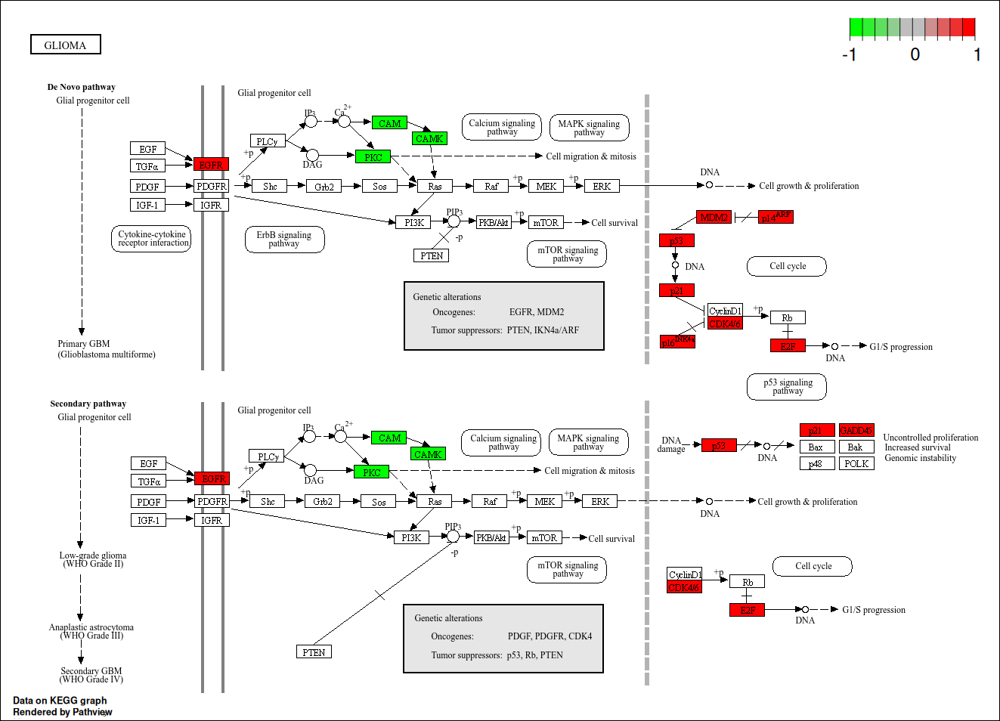
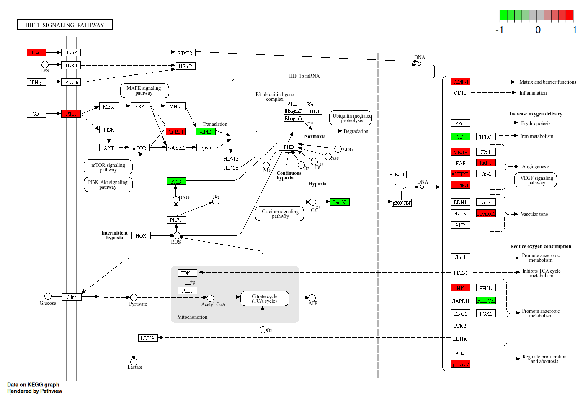
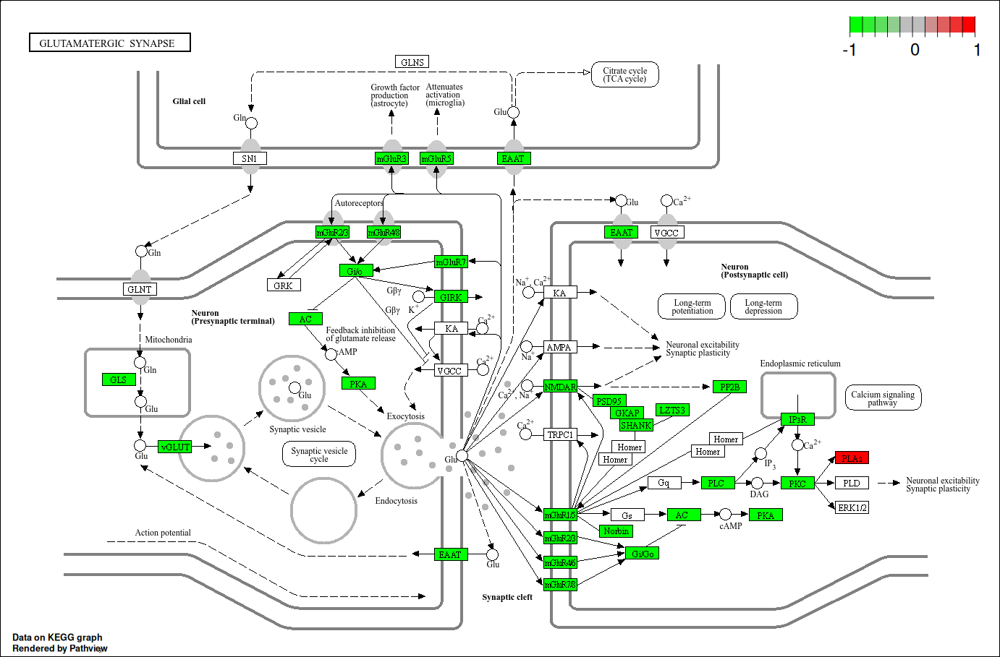
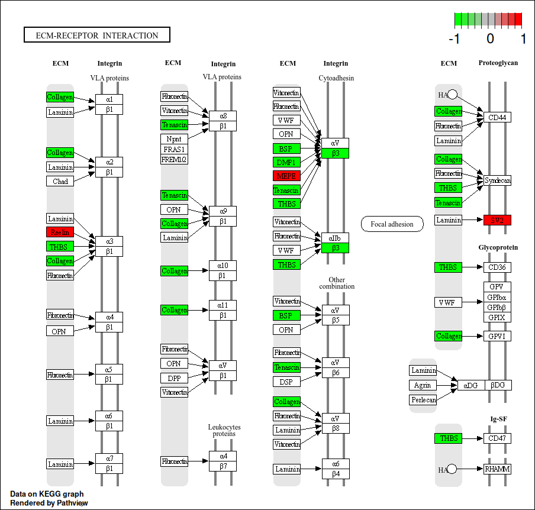
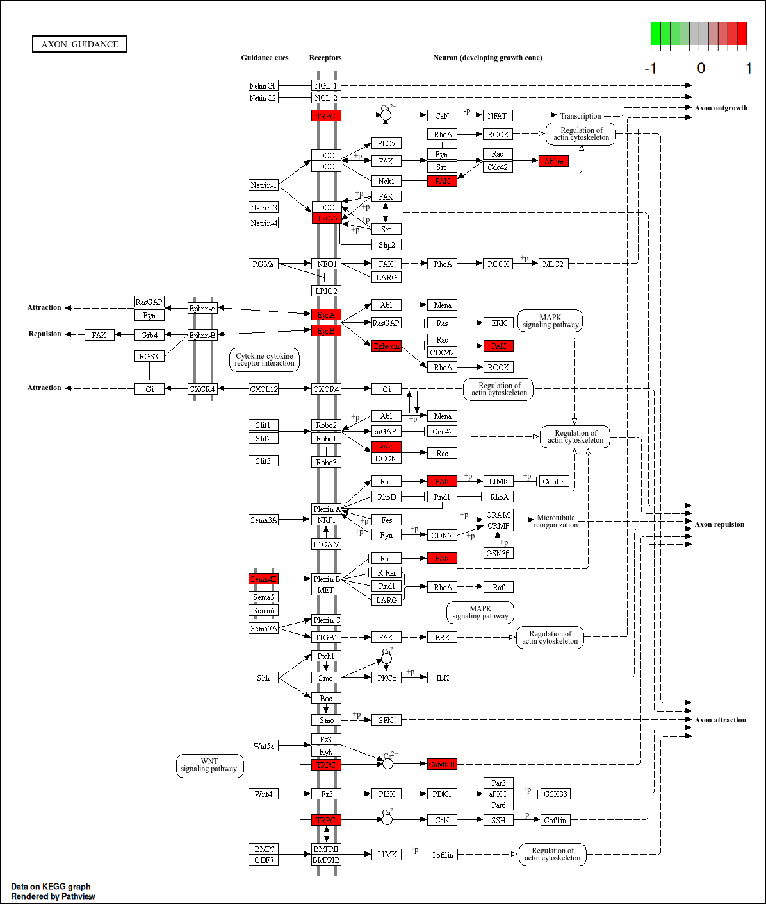

```{r setup, include=FALSE}
knitr::opts_chunk$set(echo = FALSE, message=FALSE, warning=FALSE)
#echo se true mostra codice, se false lo nasconde
```


\newpage
\tableofcontents
\newpage

```{r}
library(RColorBrewer)
library(omicsdata)
library(SummarizedExperiment)
library(tidyverse)
library(tibble)
library(edgeR)
library(limma)
library(DESeq2)
library(EDASeq)
#install.packages("factoextra")
library(factoextra)
#BiocManager::install("ComplexHeatmap")
library(ComplexHeatmap)
library(biomaRt)
library(pheatmap)
library(AnnotationDbi)
library(org.Hs.eg.db)
library(clusterProfiler)
library(patchwork)
library(enrichplot)
library(pathview)
#remotes::install_github("omnideconv/immunedeconv")
library(immunedeconv)
```

```{r}
Class_pal2way = c("control"="turquoise4", "glioma"="firebrick2")
Class_pal3way = c("control"="turquoise4", "glioma_CE"="darkred", "glioma_NE"="salmon2")
continuous_pal2 = colorRampPalette(c("white","plum1","purple4"))(100)
continuous_pal3 = colorRampPalette(c("springgreen4", "antiquewhite1", "orangered2"))(100)
```

# Biological context and study objectives 

This work is based on the study by Gill et al., 2014, which investigates the molecular and transcriptional landscape of glioblastoma using RNA sequencing approaches. The article provides a comprehensive framework for understanding the complexity of this tumor by integrating high-throughput sequencing data with spatial and biological context, offering valuable insights into the heterogeneity and cellular composition of glioblastoma.  

In this article, ***glioblastoma (GBM)*** is described as the most aggressive primary brain tumor and is characterized by extensive intratumoral heterogeneity and diffuse infiltration into surrounding brain tissue.  

Due to this infiltrative behavior, complete surgical resection is not possible, and residual tumor cells located in the margins of the tumor inevitably contribute to disease recurrence. 
Recent transcriptomic studies have shown that glioblastoma can be classified into distinct molecular subtypes, including proneural, classical, and mesenchymal.  

However, most of these classifications are based on samples derived from the **contrast-enhancing (CE)** tumor core, which corresponds to regions that appear enhanced in MRI scans due to the presence of a disrupted blood-brain barrier and are typically enriched in highly proliferative tumor cells. This focus on the tumor core may overlook critical aspects of tumor biology, particularly those related to invasion and interaction with the surrounding microenvironment.  

In contrast, **non-enhancing (NE)** tumor regions refer to the infiltrative margins of the tumor that do not show contrast enhancement in imaging and contain a heterogeneous mixture of neoplastic cells and normal brain cells, such as neurons and glial cells. These regions are thought to play a crucial role in tumor progression and recurrence, as they harbor residual tumor cells that evade surgical resection and may exhibit distinct transcriptional programs compared to the tumor core.  

In this study, we analyze RNA-seq data from glioma and non-neoplastic brain tissues to investigate differences in gene expression profiles. Specifically, we aim to compare tumor samples with normal brain tissue and to further explore differences between CE and NE tumor regions. This allows us to assess how cellular composition and tumor heterogeneity influence gene expression patterns.

\vspace{1cm}

The main objectives of this analysis are:  

- to identify genes differentially expressed between glioma and non-neoplastic tissues;  
- to evaluate the extent to which tumor samples differ from normal brain tissue at the transcriptomic level;  
- to investigate how different tumor regions (CE vs NE) contribute to variability in gene expression;  
- to interpret the results in light of cellular heterogeneity and tumor microenvironment.


# Experimental design 

## Data provenance: original article's methods

### Physical collection of samples and replicates

The researchers analyzed 69 adult patients who were presenting for open surgical resection of a glioma. They also collected 17 samples of healthy (non neoplastic) brain tissue from 11 patients undergoing surgery for other reasons (such as hydrocephalus or epilepsy) to use as a baseline for comparison. Having so little patients against so many samples obviously raises statistical independence problems.

Before beginning to remove the main bulk of the tumor (surgical debulking), the neurosurgeons took small fragments of tissue (measuring approximately 1.0 x 0.5 x 0.5 cm). To know exactly where they were taking the samples from, they used an intraoperative neuro-navigation system (Brainlab) based on MRI scans. They specifically targeted two areas: the "core" of the tumor (the contrast-enhancing area, called "CE") and the infiltrative margins of the tumor (the non-enhancing area, visible on FLAIR sequences, called "NE").

Once taken, directly in the operating room, each piece of tissue was divided in half: one piece was immediately flash-frozen in liquid nitrogen (to preserve the RNA unaltered), while the other piece was immersed in 10% formalin to "fix" and preserve the tissue structure for microscopic analysis.

### Histological analysis 

The formalin-fixed samples were cut into very thin slices, stained, and analyzed under a microscope to visually evaluate cellular density, the presence of abnormalities (like necrosis or blood vessel proliferation), and to physically mark and count the remaining entrapped healthy neurons (using a marker called NeuN).

### RNA-sequencing

Genome-wide expression profiles were generated by performing RNA-sequencing on a total of 92 flash-frozen samples. These included 39 from the tumor core (CE), 36 from the infiltrative margins (NE), and 17 from healthy brain tissue (NB).

For each sample, sequencing "libraries" were prepared using the Illumina TruSeq v2 RNA-Seq kit. The actual sequencing was performed on an Illumina HiSeq 2000 machine, which produced between 15 and 30 million "single-end, 100-base reads" per sample.

Alignment was performed via the software Tophat 2, and expression levels were calculated with Cufflinks 2, using the FPKM metric (Fragments Per Kilobase per Million mapped reads).

### Original author's bioinformatic pipeline

Using the RNA-seq data, they calculated a mathematical correlation (Spearman) between the genetic profiles of their samples and those of a massive public reference database (TCGA). This was used to classify each region of the tumor into one of the known molecular subtypes (Proneural, Classical, Mesenchymal, or Neural).

Subsequently, the authors conducted a **Computational deconvolution**: a mathematical practice performed in order to "untangle" the signal from tumor margins; in fact this samples where often a complex mixture (see the previous paragraph) of tumor and non-tumor brain cells.  
Before the deconvolution the most of the NE tumor samples were assigned to the "neural" TCGA expression profile; but this stopped being the case after mathematical unmixture.   
The authors therefore implicitly demostrated how the neural subtype was not an actual expression profile for the formerly analyzed gliomas, but an artifact caused by cellular contamination.  

## Dataset structure

The gene expression data related to the study were imported into the analysis environment as a SummarizedExperiment object (originating from the SRP044668 project), a standard data structure in Bioconductor designed to securely coordinate expression matrices with their respective clinical and technical metadata. 

The dataset consists of a single expression matrix, named raw_counts, which contains the unnormalized raw read counts. This matrix is substantial in size: it contains expression values for 63,856 genes (annotated for Homo sapiens) measured across a set of 94 biological samples.  
Alongside the data matrix, the object integrates an extensive annotation and metadata table (colData) consisting of 175 variables for each sample.

# Data and preprocessing 

## Data loading and a brief look at it

```{r}
if (file.exists("SRP044668.rds")) {
  SRP = readRDS("SRP044668.rds")
} else {
  stop("dear user: the necessary data is not present in the current working directory or 
        does not have the right name, please check.")
}
```

Let's give a look at the data's structure. 

```{r, comment=NA}
#str(SRP)

cat("The dataset contains", nrow(SRP), "genes across", ncol(SRP), "samples.")
```

```{r, comment=NA}
cat("The object contains the assay:", names(assays(SRP)))
```

## Data subsetting

We are now going to subset the data coherently with our goals.

```{r}
#sample_info = colData(SRP)$sra.sample_attributes 

# re-ordering that annoying last observation with the other glioma_NE
nuovo_ordine <- c(94, 1:93)
SRP = SRP[, nuovo_ordine]

sample_info = colData(SRP)$sra.sample_attributes

# Using new columns in the ColData I classify the columns (samples) of the 
# dataset based on the type.

# 3-way classification

colData(SRP)$class_3way =
  case_when(grepl("brain tissue", sample_info)~"control",
            grepl("contrast-enhancing", sample_info)~"glioma_CE",
            grepl("non-enhancing", sample_info)~"glioma_NE")

# 2-way classification

colData(SRP)$class_2way =
  case_when(grepl("brain tissue", sample_info)~"control",
            grepl("glioma", sample_info)~"glioma")

# FACTORIALIZATION (necessary for graphs and other procedures)

colData(SRP)$class_3way = factor(colData(SRP)$class_3way, 
                                  levels = c("control", "glioma_CE", "glioma_NE"))

colData(SRP)$class_2way = factor(colData(SRP)$class_2way, 
                                  levels = c("control", "glioma"))
```

## Unexpressed genes removal

As a team, we decide to exclude genes with expression levels at 0 or extremely low levels in all samples here, before the EDA, and not in the quality control paragraph. We do this because we believe this row filtering is not a quality control but a basic definition of the rows we consider "data". We also decide to use the FilterByExpr (from edgeR) function, a much more statistically reliable tool.

```{r, comment=NA}
# genes with all zero counts
cat(
  "Genes with all zero counts:",
  sum(rowSums(assay(SRP, "raw_counts")) == 0),
  "\n"
)

# lowly expressed genes
cat(
  "Genes with total counts lower than 15:",
  sum(rowSums(assay(SRP, "raw_counts")) < 15),
  "\n"
)

# missing values
cat(
  "Missing values in the count matrix:",
  sum(is.na(assay(SRP, "raw_counts"))),
  "\n"
)

# duplicated genes
cat(
  "Duplicated gene identifiers:",
  sum(duplicated(rownames(SRP))),
  "\n"
)

# dimensions before filtering
cat(
  "Dataset dimensions before filtering:",
  nrow(SRP),
  "genes and",
  ncol(SRP),
  "samples.\n"
)

# filtering
keep = filterByExpr(
  assay(SRP, "raw_counts"),
  group = SRP$class_3way
)

SRP = SRP[keep, ]

# dimensions after filtering
cat(
  "Dataset dimensions after filtering:",
  nrow(SRP),
  "genes and",
  ncol(SRP),
  "samples."
)
```

# Pre-normalization EDA 

Now, before proceeding, we will use some graphical tools to investigate the general nature of our counts. This analysis is going to be helpful in guiding us through the right choices in the next section: data normalization and quality control.

## Analysis of the genetic expression distribution in the samples

```{r}

meta_df = data.frame(Sample=colnames(SRP), Class2way=SRP$class_2way, Class3way=SRP$class_3way)

dfCounts_long = as.data.frame(assay(SRP, "raw_counts")) |>
  rownames_to_column(var="Gene") |>
  pivot_longer(cols=-Gene, names_to = "Sample", values_to = "Expression")

dfCounts_long = dfCounts_long |> left_join(meta_df, by = "Sample")

#dfCounts_long |>
#  ggplot( aes(x=Sample, y=Expression, fill = Class2way)) +
#  geom_boxplot() +
#  scale_fill_manual(values=Class_pal2way) +
#  theme(
#    axis.text.x = element_blank(),  
#    axis.ticks.x = element_blank(), 
#    axis.title.x = element_blank()  
#  )

boxplot(assay(SRP, "raw_counts"),
        las = 2,
        col=Class_pal2way[colData(SRP)$class_2way],
        #ylab = "Expression (raw)",
        main = "Boxplot of raw counts")

  
```
This are boxplots of the expression levels of some randomly chosen samples. As seen in the laboratories, we clearly need a logarithmic transformation.

```{r}
dfCounts_long$Expression = log1p(dfCounts_long$Expression)

#dfCounts_long |>
#  ggplot( aes(x=Sample, y=Expression, fill = Class2way)) +
#  geom_boxplot() +
#  scale_fill_manual(values=Class_pal2way) +
#  theme(
#    axis.text.x = element_blank(),  
#    axis.ticks.x = element_blank(), 
#    axis.title.x = element_blank())

# creation of a new log1p assay in the SRP summarized experiment object
assays(SRP)$logcounts <- log1p(assay(SRP, "raw_counts"))

boxplot(assay(SRP, "logcounts"),
        #outline = FALSE,
        las = 2,
        col=Class_pal2way[colData(SRP)$class_2way],
        ylab = "Expression (log1p)",
        main = "Boxplot after log1p transformation")

```
Now the distributions are much better.

Here we show the distribution densities conditioned on the sample class of the expressions.

```{r}
dfCounts_long |>
  ggplot(aes(x=Expression, fill=Class2way, colour = Class2way)) +
        geom_density(alpha=0.4) +
        scale_fill_manual(values = Class_pal2way) +
        scale_color_manual(values = Class_pal2way) +
        ggtitle("2-way Density plot")

dfCounts_long |>
  ggplot(aes(x=Expression, fill=Class3way, colour = Class3way)) +
        geom_density(alpha=0.4) +
        scale_fill_manual(values = Class_pal3way) +
        scale_color_manual(values = Class_pal3way) +
        ggtitle("3-way Density plot")
```

## MD, MA and RLE plots

### MA

```{r}
limma::plotMA(assay(SRP, "logcounts"))
```

Here the limma's plotMA() function is working as a quality control tool. It's confronting the first sample with the mean of the others, and the asymmetries clearly comunicate us the need for normalization.

### MD

```{r}
EDASeq::MDPlot(assay(SRP, "raw_counts"), c(6, 7))
```

### RLE

```{r}
plotRLE(assay(SRP,"raw_counts"), outline = FALSE, las = 2,
        ylab = "RLE", main = "RLE of raw counts", col = Class_pal3way[colData(SRP)$class_3way])
```

Both the MD and RLE plots strengthen what was already visible in the MA: the data need normalization.

## PCA

```{r}
pca = prcomp(t(assay(SRP, "logcounts")))
screeplot(pca)

fviz_pca_ind(pca,
             geom.ind = "point",       
             pointsize = 1,            
             col.ind = SRP$class_3way,      
             palette = Class_pal3way,       
             addEllipses = TRUE,       
             ellipse.type = "convex")
```

Lastly, we here performed and plotted a pca on the un-normalized data. 

## GC content bias evaluation  
GC content can introduce biases in library preparation and sequencing, potentially affecting the quantification of gene expression.
It's important to check GC content bias for eventually filtering out sequences.  
First, we need to retrieve the amount of *GC* for each gene. To do this we use the **rowRanges** row variables and the **getGeneLengthAndGCContent** function of the *EDASeq* package.

```{r}
#Gene ID extraction and annotation retrieval
gene_ids = as.character(rowRanges(SRP)$gene_id)
gene_ids = sub("\\..*$", "", gene_ids)

gc_info = getGeneLengthAndGCContent(
  id = gene_ids,
  org = "hg38",
  mode = "org.db"
)
```

Gene identifiers were extracted from the dataset and processed to remove version numbers. GC content and gene length information were then retrieved using EDASeq annotation functions based on the hg38 reference genome.

```{r}
#Data cleaning and alignment
gc_info = gc_info[!is.na(gc_info[, 2]), ]

valid_genes = gene_ids %in% rownames(gc_info)

SRP_filtered = SRP[valid_genes, ]
gene_ids = gene_ids[valid_genes]
```

Genes lacking GC content information were removed.  
The dataset was then aligned with the annotation data to retain only genes with available GC information, ensuring consistency between expression data and gene features.

```{r}
#Count matrix preparation
counts_matrix = assay(SRP_filtered, "raw_counts")

rownames(counts_matrix) = gene_ids
```

The raw count matrix was extracted and gene identifiers were standardized to ensure consistency with the annotation dataset.

```{r}
#Removal of duplicated genes
dup_genes = duplicated(rownames(counts_matrix))

counts_matrix = counts_matrix[!dup_genes, ]
gc_info = gc_info[!dup_genes, ]
SRP_filtered = SRP_filtered[!dup_genes, ]
```

Duplicated gene identifiers, arising from multiple transcript mappings, were removed to ensure a one-to-one correspondence between genes and expression values.

```{r}
#Construction of SeqExpressionSet
seq_set = newSeqExpressionSet(
  counts = counts_matrix,
  phenoData = AnnotatedDataFrame(
    data.frame(
      condition = SRP_filtered$class_3way,
      row.names = colnames(counts_matrix)
    )
  ),
  featureData = AnnotatedDataFrame(
    data.frame(
      gc_content = gc_info[, 2],
      gene_length = gc_info[, 1]
    )
  )
)
```

A SeqExpressionSet object was constructed to integrate expression data with sample metadata and gene-level features, including GC content and gene length, enabling downstream bias analysis.

```{r}
#GC bias plot
biasPlot(seq_set, "gc_content", log = TRUE)
```
The GC bias plot shows a clear non-linear relationship between gene expression and GC content across all samples. Expression levels increase at intermediate GC values and decrease at both low and high GC content, indicating the presence of GC-dependent technical bias. The consistency of this pattern across samples suggests that the bias is systematic rather than sample-specific.

GC content bias was evaluated as part of the quality assessment to investigate potential gene-specific technical effects. Although a GC-dependent trend was observed, normalization was subsequently performed using DESeq2, which accounts for major sources of between-sample variability. Therefore, GC bias was not explicitly corrected but considered in the interpretation of the results.


# Data normalization and quality control

Although GC-dependent bias was observed during exploratory analysis, normalization was performed using DESeq2, which accounts for major sources of between-sample variability. Additional within-sample normalization was not applied to maintain consistency with the statistical modeling framework.


## Data extraction and DESeq2 dataset construction

```{r}
counts_matrix = assay(SRP_filtered, "raw_counts")
metadata = as.data.frame(colData(SRP))

dds = DESeqDataSetFromMatrix(
  countData = counts_matrix,
  colData = metadata,
  design = ~ class_3way
)

```

A DESeq2 dataset object was created by combining the raw count matrix with sample metadata and specifying the experimental design based on the class_3way variable.  

## DESeq2 normalization

```{r}
dds = DESeq(dds)
```

Normalization was carried out within the DESeq2 framework through the estimation of size factors, correcting for differences in sequencing depth and compositional biases across samples.

## Variance stabilizing transformation (VST)
```{r}
vsd = vst(dds, blind = FALSE)
```

A variance stabilizing transformation (VST) was then applied to reduce the dependence of variance on mean expression levels, making the data more suitable for exploratory analyses and visualization such as PCA and clustering. The VST is much more robust to distortions than simple log1p transformation.


# Post-normalization EDA

Post-normalization quality control is performed to assess the effectiveness of the normalization procedure. In particular, boxplots and Relative Log Expression (RLE) plots are used to evaluate the distribution of expression values across samples and to verify the reduction of technical variability. 
These visualizations allow us to determine whether samples are comparable and suitable for downstream analyses.

## Boxplot

```{r}
boxplot(assay(vsd),
        #outline = FALSE,
        las = 2,
        col=Class_pal2way[colData(vsd)$class_2way],
        ylab = "Expression (VST)",
        main = "Boxplot after normalization")


meta_df = data.frame(Sample=colnames(vsd), Class2way=SRP$class_2way, Class3way=SRP$class_3way)

dfCounts_long = as.data.frame(assay(vsd)) |>
  rownames_to_column(var="Gene") |>
  pivot_longer(cols=-Gene, names_to = "Sample", values_to = "Expression")

dfCounts_long = dfCounts_long |> left_join(meta_df, by = "Sample")

#dfCounts_long |>
#  ggplot( aes(x=Sample, y=Expression, fill = Class2way)) +
#  geom_boxplot() +
#  scale_fill_manual(values=Class_pal2way) +
#  theme(
#    axis.text.x = element_blank(),  
#    axis.ticks.x = element_blank(), 
#    axis.title.x = element_blank()  
# )

```
Boxplots of variance-stabilized data show highly consistent expression distributions across samples after normalization.  
The alignment of medians and the comparable spread of values indicate that technical variability has been effectively reduced, making the samples suitable for downstream comparative analysis.

## Density plot

```{r}
dfCounts_long |>
  ggplot(aes(x=Expression, fill=Class2way, colour = Class2way)) +
        geom_density(alpha=0.4) +
        scale_fill_manual(values = Class_pal2way) +
        scale_color_manual(values = Class_pal2way) +
        labs(title = "Density Plot after VST Normalization")
```
The density plot of VST-normalized data shows a characteristic shift of unexpressed genes to a baseline value of approximately 9. This offset is the expected mathematical behavior of the Variance Stabilizing Transformation, which stabilizes the variance at the lower end of expression. Most importantly, the perfect overlap of the density curves across the experimental groups confirms that technical biases have been successfully mitigated, ensuring the samples are robustly comparable for downstream analyses.

## RLE plot 

```{r}
plotRLE(assay(vsd),
        outline = FALSE,
        las = 2,
        col=Class_pal3way[colData(vsd)$class_3way],
        ylab = "RLE",
        main = "RLE after normalization")
```
The RLE plot shows values centered around zero with a consistent spread across samples, indicating that normalization effectively reduced technical variability.
A small number of samples display slight deviations from the overall trend, but these remain limited and do not suggest the presence of strong outliers or residual technical bias. Overall, the data appear well-balanced and suitable for downstream analysis.

Now we perform Principal Component Analysis (PCA) on variance-stabilized data to investigate the main sources of variation within the dataset and to evaluate the separation between biological groups. This analysis enables visualization of sample clustering patterns and helps assess whether normalization preserves biologically meaningful differences.

## PCA

```{r}
pca = prcomp(t(assay(vsd)))
screeplot(pca)

fviz_pca_ind(pca,
             geom.ind = "point",       
             pointsize = 1,            
             col.ind = vsd$class_3way,      
             palette = Class_pal3way,       
             addEllipses = TRUE,       
             ellipse.type = "convex")
```
The PCA plot shows a partial separation between glioma and control samples along the first principal component, indicating that biological differences contribute significantly to the overall variability.  
Control samples tend to cluster more tightly, while glioma samples display greater dispersion, reflecting higher heterogeneity within the tumor group. A certain degree of overlap is observed, likely due to the presence of non-neoplastic components within glioma samples or infiltrative tumor regions.  Overall, the distribution of samples suggests that normalization was effective and that biologically relevant variation is captured by the principal components.

Due to the Screeplot similar PC2 and PC3 variances we also plot here in the post-normalization EDA a graph made with PC1 and PC3 as axes.

```{r}
fviz_pca_ind(pca,
             geom.ind = "point", 
             axes = c(1,3),
             pointsize = 1,            
             col.ind = vsd$class_3way,      
             palette = Class_pal3way,       
             addEllipses = TRUE,       
             ellipse.type = "convex")
```
Interestingly, the PC3 axis spreads the data points quite similarly to the PC2 (they probably go alongside, even if they are independent by definition). Let's try to plot the PC2 and the PC3 together then.

```{r}
fviz_pca_ind(pca,
             geom.ind = "point", 
             axes = c(2,3),
             pointsize = 1,            
             col.ind = vsd$class_3way,      
             palette = Class_pal3way,       
             addEllipses = TRUE,       
             ellipse.type = "convex")
```
Actually, the PC2 goes approximately alongside the PC3 only for control and glioma_NE points, In glioma_CE they seem to be inversely correlated (even if, as already said, they must be orthogonal by definition when we look at the whole data points)!

### Consulting the PCA runes: a forecast of DEGs

In this paragraph we aim to get a first glance at our dataset transcriptomical variability using the PCs loadings

```{r}
pc1_loadings = pca$rotation[,1]
sorted_pc1_loadings = pc1_loadings[order(abs(pc1_loadings), decreasing = TRUE)]
pc1_var_drivers_df = data.frame(names(sorted_pc1_loadings[1:10]), as.numeric(sorted_pc1_loadings[1:10]))
colnames(pc1_var_drivers_df) = c("Gene", "Contribution to PC1")

pc1_var_drivers_df$Gene_clean <- gsub("\\..*", "", pc1_var_drivers_df$Gene)

mart <- useMart("ensembl", dataset = "hsapiens_gene_ensembl")

gene_symbols <- getBM(
  attributes = c("ensembl_gene_id", "external_gene_name"),
  filters = "ensembl_gene_id",
  values = pc1_var_drivers_df$Gene_clean,
  mart = mart
)

pc1_var_drivers_df =
  pc1_var_drivers_df |> 
  left_join(
    gene_symbols,
    by = c("Gene_clean" = "ensembl_gene_id")
  )

colnames(pc1_var_drivers_df) = c("Ensembl ID", "Contribution to PC1", "Clean ensembl ID", "Gene name")
pc1_var_drivers_df = pc1_var_drivers_df[, c(4, 1, 3, 2)]

knitr::kable(pc1_var_drivers_df, caption = "PC1 loadings")

```

This 10 genes and their contribution to PC1 are sending us a clear hint: the most veriability in our dataset is encoded in the loss of neurobiological functions. The genes are all neurobiology related (**Receptors**: *GRIN1*, *GABRA1* ; **vescicular traffic**: *SLC17A7*, *SYT1*,... ; **Membrane and cytoskeleton**: *PACSIN1*, *NEFL* ; **Intracellular signaling**: *CAMK2A*, *VSNL1* ), and the less expressed they are, the more on the right of the graph (positive values) the samples are going to be, alongside the glioma_CE samples. **What we can state now then, is that tumor glioma cells tend with all probabilities to loose the expression of neuronal functions.**


```{r}
pc2_loadings = pca$rotation[,2]
sorted_pc2_loadings = pc2_loadings[order(abs(pc2_loadings), decreasing = TRUE)]
pc2_var_drivers_df = data.frame(names(sorted_pc2_loadings[1:10]), as.numeric(sorted_pc2_loadings[1:10]))
colnames(pc2_var_drivers_df) = c("Gene", "Contribution to PC2")

pc2_var_drivers_df$Gene_clean <- gsub("\\..*", "", pc2_var_drivers_df$Gene)

gene_symbols <- getBM(
  attributes = c("ensembl_gene_id", "external_gene_name"),
  filters = "ensembl_gene_id",
  values = pc2_var_drivers_df$Gene_clean,
  mart = mart
)

pc2_var_drivers_df =
  pc2_var_drivers_df |> 
  left_join(gene_symbols, by = c("Gene_clean" = "ensembl_gene_id"))

colnames(pc2_var_drivers_df) = c("Ensembl ID", "Contribution to PC2", "Clean ensembl ID", "Gene name")
pc2_var_drivers_df = pc2_var_drivers_df[, c(4, 1, 3, 2)]

knitr::kable(pc2_var_drivers_df, caption = "PC2 loadings")

```

This new bundle of genes is now completely composed of oligodentrocytes' (and partially astrocites') associated genes. We believe it's separating samples with regard to their cellular composition (neurons vs glia cells proportion).

```{r}
pc3_loadings = pca$rotation[,3]
sorted_pc3_loadings = pc3_loadings[order(abs(pc3_loadings), decreasing = TRUE)]
pc3_var_drivers_df = data.frame(names(sorted_pc3_loadings[1:10]), as.numeric(sorted_pc3_loadings[1:10]))
colnames(pc3_var_drivers_df) = c("Gene", "Contribution to PC3")

pc3_var_drivers_df$Gene_clean <- gsub("\\..*", "", pc3_var_drivers_df$Gene)

gene_symbols <- getBM(
  attributes = c("ensembl_gene_id", "external_gene_name"),
  filters = "ensembl_gene_id",
  values = pc3_var_drivers_df$Gene_clean,
  mart = mart
)

pc3_var_drivers_df =
  pc3_var_drivers_df |> 
  left_join(gene_symbols, by = c("Gene_clean" = "ensembl_gene_id"))

colnames(pc3_var_drivers_df) = c("Ensembl ID", "Contribution to PC3", "Clean ensembl ID", "Gene name")
pc3_var_drivers_df = pc3_var_drivers_df[, c(4, 1, 3, 2)]

knitr::kable(pc3_var_drivers_df, caption = "PC3 loadings")

```

Lastly, we encounter a clearly sex-driven PC. Positive genes (*XIST*, *TSIX*,...) are female transcripts, while negatives (*DMRT2*,...) are males. In spite of this there are other genes with non sex-related functions such as Lactotransferrin or SOX10. We suppose this might be linked to dataset imbalance between sex and tumor rapresentation (e.g. all SOX10 upregulated tumors were coming from females) but that is not necessarily the case; the fact the sample population came from only 27 different patients makes this biases really easy to appear (please find the article's supplementary methods in the zip file sent, table S1).

### Sex and the plot

Here we aim to confirm the sex separation PC3 might be doing what we supposed in the previous paragraph. Before starting, we had to set a M/F ground truth but this has not been easy since we didn't find a downloadable CSV (or any tabular file) of the patient's table (table S1), and this PDF table was moreover lacking any form of information to be aligned to our 94 brain samples. We therefore exploited the percentual amount of Y chromosome reads. 

```{r}
df_qc <- data.frame(
  chrY_reads = colData(SRP)$`recount_qc.aligned_reads%.chry`
)

ggplot(df_qc, aes(x = chrY_reads)) +
  geom_histogram(bins = 50, fill = "steelblue", color = "black") +
  geom_vline(xintercept = 0.035, color = "red", linetype = "dashed", size = 1) +
  theme_minimal() +
  labs(
    title = "chrY reads distribution",
    x = "Reads on chrY (%)",
    y = "number of samples"
  )

estimated_sex = ifelse(
  colData(SRP)$`recount_qc.aligned_reads%.chry` > 0.035,
  "male",
  "female"
)

```

```{r, comment=NA}
summary(colData(SRP)$`recount_qc.aligned_reads%.chry`)
```

```{r, comment=NA}
table(estimated_sex, colData(SRP)$class_2way)
```

```{r, comment=NA}
table(estimated_sex, colData(SRP)$class_3way)
```

```{r}
estimated_sex = factor(
  estimated_sex,
  levels = c("female", "male")
)

fviz_pca_ind(
  pca,
  geom.ind = "point",
  axes = c(1,3),
  pointsize = 2,
  col.ind = estimated_sex,
  palette = c("hotpink", "lightblue"),
  addEllipses = TRUE,
  ellipse.type = "convex"
)
```

```{r}
fviz_pca_ind(
  pca,
  geom.ind = "point",
  axes = c(1,2),
  pointsize = 2,
  col.ind = estimated_sex,
  palette = c("hotpink", "lightblue"),
  addEllipses = TRUE,
  ellipse.type = "convex"
)
```

It's clear how the third component captures an information about the samples estimated gender the second and first components are not predicting.


# Identification of of differentially expressed genes (DEGs)

Differential expression analysis was performed using the DESeq2 statistical framework to identify genes showing significant expression changes between the different biological conditions.  
Since the dataset includes three groups (`control`, `glioma_CE`, and `glioma_NE`), three pairwise comparisons were carried out:

- glioma_CE vs control 
- glioma_NE vs control 
- glioma_NE vs glioma_CE  

These contrasts allow the identification of both general tumor-associated transcriptional alterations and more specific molecular differences between contrast-enhancing and non-enhancing glioma regions, providing insight into intratumoral heterogeneity.

The `results()` function was used to extract differential expression statistics from the fitted DESeq2 model for each comparison, including log2 fold changes, Wald test p-values, and adjusted p-values corrected for multiple testing.

```{r}
#resultsNames(dds)

#glioma_ce - control
res_ce = results(dds, contrast = c("class_3way", "glioma_CE", "control"))
```

```{r}
#glioma_ne - control
res_ne = results(dds, contrast = c("class_3way", "glioma_NE", "control"))
```

```{r}
res_ne_ce = results(dds, contrast = c("class_3way", "glioma_NE", "glioma_CE"))
```

Missing values were removed from the DEG result tables using `na.omit()`.  
These NA values are typically associated with genes showing extremely low expression levels or insufficient information for reliable statistical estimation. Removing them simplifies downstream analyses and visualization steps by retaining only genes with valid differential expression statistics.

```{r}
res_ne = na.omit(res_ne)
res_ce = na.omit(res_ce)
res_ne_ce = na.omit(res_ne_ce)
```

**$log_2$ fold change of the gene expression was computed using:**

$\log_{2_{\mathrm{NE\_CE}}}\left(\frac{\text{expression in glioma\_NE}}{\text{expression in glioma\_CE}}\right)$

$\log_{2_{\mathrm{NE}}}\left(\frac{\text{expression in glioma\_NE}}{\text{expression in control}}\right)$

$\log_{2_{\mathrm{CE}}}\left(\frac{\text{expression in glioma\_CE}}{\text{expression in control}}\right)$


## MA plot

MA plots were generated to visualize the relationship between the mean of normalized counts and the log2 fold change across the different comparisons.  
In these plots, each point represents a gene, the x-axis corresponds to the **average normalized expression level** across samples, while the y-axis represents the **log2 fold change** between the two conditions.  
MA plots provide an overview of the global differential expression patterns, allowing the identification of genes showing substantial expression changes as well as the overall distribution of transcriptional differences between groups.

```{r}
plotMA(
  res_ce,
  ylim = c(-8, 8),
  colSig = "deeppink1",
  colNonSig = "grey58",
  main = "MA plot: glioma_CE vs control"
)
```
This first MA plot that compare glioma_CE and control samples shows a broad distribution of genes with both positive and negative log2 fold changes, indicating substantial transcriptional differences between tumor and non-tumor tissues.  

A large number of significantly differentially expressed genes are observed across a wide range of normalized expression values. Most genes remain centered around zero, reflecting genes with similar expression levels between the two conditions, while several genes display strong positive or negative fold changes, suggesting marked upregulation or downregulation in glioma_CE samples relative to controls.

The presence of genes with very large fold changes highlights profound molecular alterations associated with the tumor state.

```{r}
plotMA(
  res_ne,
  ylim = c(-8, 8),
  colSig = "deeppink1",
  colNonSig = "grey58",
  main = "MA plot: glioma_NE vs control"
)
```
Here the MA plot compare glioma_NE and control samples and also reveals widespread transcriptional differences between tumor and non-tumor tissues. A large number of genes show significant positive or negative log2 fold changes across different expression levels, indicating extensive deregulation associated with the glioma condition.  
The broad dispersion of points, especially among low- and medium-expression genes, may also reflect tissue sampling heterogeneity and possible contamination from surrounding non-tumoral brain tissue or infiltrating cell populations. Since margin glioma samples are often composed of mixed cellular environments, part of the observed variability could derive from differences in cellular composition rather than purely tumor-specific transcriptional alterations.  
Compared with the glioma_CE vs control comparison, the overall distribution appears slightly more compact, suggesting a somewhat lower degree of transcriptional divergence from control samples. Nevertheless, several genes still exhibit strong fold changes, highlighting relevant molecular alterations in the non-enhancing glioma region.

```{r}
plotMA(
  res_ne_ce,
  ylim = c(-8, 8),
  colSig = "deeppink1",
  colNonSig = "grey58",
  main = "MA plot: glioma_NE vs glioma_CE"
)
```
This last MA plot compare glioma_NE and glioma_CE samples. It shows that most genes are distributed around a log2 fold change close to zero, indicating broadly similar expression levels between the two tumor regions. Nevertheless, a subset of genes displays substantial positive or negative fold changes, suggesting the presence of region-specific transcriptional differences between contrast-enhancing and non-enhancing glioma areas.  
Part of these differences may also be influenced by tissue sampling heterogeneity and contamination from non-tumoral cell populations. In particular, non-enhancing regions are often characterized by infiltrating tumor cells intermixed with normal brain tissue, immune cells, and stromal components, which can contribute to the observed transcriptional variability.  
Compared with the tumor-versus-control comparisons, the overall distribution appears more compact, reflecting the greater biological similarity between the two glioma subtypes despite the presence of distinct molecular alterations.

## VOLCANO plot

Volcano plots were generated to simultaneously visualize the magnitude of gene expression changes and their statistical significance across the different comparisons.  
In these plots, each point represents a gene, the x-axis corresponds to the **log2 fold change** between the two conditions, while the y-axis represents the **negative logarithm of the adjusted p-value** (`-log10(padj)`).

This type of visualization allows the rapid identification of genes showing both large expression changes and high statistical significance. Genes located farther from zero on the x-axis and higher on the y-axis represent the most strongly differentially expressed genes between the compared conditions.

```{r}
#prepariamo il dataframe
res_df = as.data.frame(res_ce)

#prepariamo la colonna di significatività 
res_df$significant = ifelse(
  res_df$padj < 0.05 &
  abs(res_df$log2FoldChange) > 1,
  "Significant",
  "Not significant"
)

#volcano plot
ggplot(res_df,
       aes(x = log2FoldChange,
           y = -log10(padj),
           color = significant)) +

  geom_point(alpha = 0.6, size = 1.5) +

  scale_color_manual(values = c(
    "Not significant" = "grey58",
    "Significant" = "deeppink1"
  )) +

  theme_minimal() +

  labs(
    title = "Volcano plot glioma_CE vs control",
    x = "Log2 Fold Change",
    y = "-Log10 adjusted p-value"
  )
```
The volcano plot comparing glioma_CE and control samples highlights a large number of significantly differentially expressed genes between tumor and non-tumor tissues.  
Significant genes are distributed on both sides of the plot, indicating both upregulated and downregulated genes in glioma_CE samples relative to controls. Several genes also show very high fold changes and strong statistical significance, reflecting substantial transcriptional alterations associated with the tumor condition.  

```{r}
#prepariamo il dataframe
res_df = as.data.frame(res_ne)

#prepariamo la colonna di significatività 
res_df$significant = ifelse(
  res_df$padj < 0.05 &
  abs(res_df$log2FoldChange) > 1,
  "Significant",
  "Not significant"
)

#volcano plot
ggplot(res_df,
       aes(x = log2FoldChange,
           y = -log10(padj),
           color = significant)) +

  geom_point(alpha = 0.6, size = 1.5) +

  scale_color_manual(values = c(
    "Not significant" = "grey58",
    "Significant" = "deeppink1"
  )) +

  theme_minimal() +

  labs(
    title = "Volcano plot glioma_NE vs control",
    x = "Log2 Fold Change",
    y = "-Log10 adjusted p-value"
  )
```
This second volcano plot compare glioma_NE and control samples, it also shows extensive differential expression patterns, with numerous significantly deregulated genes across the two conditions.  
Compared with the glioma_CE comparison, the distribution appears slightly less extreme, although several genes still exhibit high fold changes and strong statistical significance, supporting the presence of marked molecular alterations in the non-enhancing glioma region.  
The less pronounced separation between conditions may partially reflect tissue sampling heterogeneity and contamination from surrounding non-tumoral brain tissue. Since non-enhancing glioma regions often contain infiltrating tumor cells intermixed with normal cellular components, part of the observed transcriptional profile could derive from differences in cellular composition.

```{r}
#prepariamo il dataframe
res_df = as.data.frame(res_ne_ce)

#prepariamo la colonna di significatività 
res_df$significant = ifelse(
  res_df$padj < 0.05 &
  abs(res_df$log2FoldChange) > 1,
  "Significant",
  "Not significant"
)

#volcano plot
ggplot(res_df,
       aes(x = log2FoldChange,
           y = -log10(padj),
           color = significant)) +

  geom_point(alpha = 0.6, size = 1.5) +

  scale_color_manual(values = c(
    "Not significant" = "grey58",
    "Significant" = "deeppink1"
  )) +

  theme_minimal() +

  labs(
    title = "Volcano plot glioma_NE vs glioma_CE",
    x = "Log2 Fold Change",
    y = "-Log10 adjusted p-value"
  )
```
The volcano plot highlights numerous significantly differentially expressed genes between glioma_NE and glioma_CE samples.  
Significant genes are distributed on both sides of the plot, indicating the presence of genes specifically upregulated in each tumor region. Most genes display moderate fold changes around zero, reflecting the overall biological similarity between the two glioma subtypes.  
Nevertheless, several genes show strong expression differences and high statistical significance, supporting the presence of region-specific transcriptional programs within the tumor microenvironment.  
Part of the observed variability may also derive from tissue sampling heterogeneity and contamination from non-tumoral cellular components. In particular, non-enhancing regions often contain infiltrating tumor cells intermixed with normal brain tissue, immune cells, and stromal populations, which can influence the transcriptional profile and contribute to the moderate separation observed between the two regions.

## Top genes

Differentially expressed genes (DEGs) were filtered by selecting genes with an adjusted p-value (`padj`) lower than **0.05**.  
The number of significant DEGs was then evaluated for each comparison in order to quantify the extent of transcriptional differences between the analyzed conditions.

For each comparison, significant genes were ranked according to adjusted p-value, and the top 20 most significant DEGs were selected for further inspection.  
Since gene identifiers were initially reported as Ensembl IDs, an additional annotation step was performed to convert them into gene symbols, allowing a clearer biological interpretation of the results.

```{r, comment=NA}
#filtering DEGs 
degs_ce= res_ce[res_ce$padj < 0.01 & abs(res_ce$log2FoldChange) > 2,]
cat("In glioma_ce against control there are",nrow(degs_ce),"DEGs \n")

degs_ne= res_ne[res_ne$padj < 0.01 & abs(res_ne$log2FoldChange) > 2, ]
cat("In glioma_ne against control there are",nrow(degs_ne),"DEGs\n")

degs_ne_ce= res_ne_ce[res_ne_ce$padj < 0.01 & abs(res_ne_ce$log2FoldChange) > 2,]
cat("In glioma_ne against glioma_ce there are",nrow(degs_ne_ce),"DEGs")
```
Given the extremely high amount of DEGs (up to 60% of the trascriptome) found using a 0.05 p-value threshold we adjust it at 0.01 and set a log2Foldchange threshold at 2.

```{r}
# ordering the most significative
for (v in c("_ce", "_ne", "_ne_ce")) {  
  nome_degs = paste0("degs",v)
  nome_ordered = paste0("res_ordered",v)
  nome_top = paste0("top_deg",v)
  
  assign(nome_ordered, get(nome_degs)[order(get(nome_degs)$padj), ])
  assign(nome_top, head(get(nome_ordered),20))
  
  # ID conversion 
  temp_df <- get(nome_top)
  temp_df$Gene_clean = gsub("\\..*", "", rownames(temp_df))
  

  #riusiamo mart x conversione
  gene_symbols <- getBM(
    attributes = c(
      "ensembl_gene_id",
      "external_gene_name"
    ),
    filters = "ensembl_gene_id",
    values = temp_df$Gene_clean,
    mart = mart
    )
 
  temp_df <- data.frame(Ensembl_ID = rownames(temp_df),temp_df)
    
    temp_df <- temp_df |>
    left_join(
      gene_symbols,
      by = c("Gene_clean" = "ensembl_gene_id")
    )
    
    temp_df$external_gene_name[
  is.na(temp_df$external_gene_name) |
  temp_df$external_gene_name == ""
] <- "nameless_gene"
    
  #clean teable
    
  temp_df = temp_df[, c(
      "external_gene_name",
      "log2FoldChange",
      "Ensembl_ID"
    )]
    
  colnames(temp_df) = c(
      "Gene",
      "Log2FoldChange"
    )
    
  assign(nome_top, temp_df)
  
  
  }
 
knitr::kable(caption = "TOP 20 DEGs between glioma_ce vs control",top_deg_ce[,1:2])
```
The top differentially expressed genes identified in the glioma_CE versus control comparison reveal strong transcriptional alterations associated with the tumor condition.  
Several highly upregulated genes belong to the *HOXC* family, including *HOXC9*, *HOXC11*, and *HOXC13*, which are known developmental transcription factors frequently associated with oncogenic processes, cellular proliferation, and tumor progression.

In addition, genes such as *PITX2* and multiple long non-coding RNAs (HOXC-AS2, IL21-AS1, and LINC family members) suggest the activation of regulatory pathways involved in epigenetic modulation and transcriptional reprogramming. The very high log2 fold change values observed for these genes indicate substantial molecular divergence between contrast-enhancing glioma tissue and normal control samples, supporting the presence of a strongly altered tumor-associated transcriptional profile.  

```{r}
knitr::kable(caption = "TOP 20 DEGs between glioma_ne vs control",top_deg_ne[,1:2])
```
The top differentially expressed genes identified in the glioma_NE versus control comparison also reveal marked transcriptional alterations associated with the tumor condition.  
Several strongly upregulated genes belong to the *HOXC* family, including *HOXC9*, *HOXC11*, and *HOXC13*, together with regulatory non-coding transcripts such as *HOXC-AS2* and *IL21-AS1*. These genes are commonly associated with developmental programs, transcriptional regulation, and oncogenic processes.  
The presence of genes such as *PITX2* and multiple long non-coding RNAs further supports the activation of tumor-related regulatory pathways in the non-enhancing glioma region.  
Although the overall expression profile appears broadly similar to that observed in the contrast-enhancing region, the slightly lower fold changes may reflect the greater cellular heterogeneity of glioma_NE samples, which often contain infiltrating tumor cells intermixed with non-tumoral brain tissue.

Overall, these findings indicate that the non-enhancing region still retains a strongly altered molecular profile compared with normal control tissue, despite the presence of potential tissue composition differences.

```{r}
knitr::kable(caption = "TOP 20 DEGs between glioma_ne vs glioma_ce",top_deg_ne_ce[,1:2])
```
The top differentially expressed genes between glioma_NE and glioma_CE reveal important regional transcriptional differences within the tumor microenvironment. Several highly expressed genes, including *SYP*, *CAMK2A*, *NRGN*, *PRKCG*, *SLC6A7*, and *TBR1*, are strongly associated with neuronal signaling, synaptic activity, and neurodevelopmental functions.  
The enrichment of neuronal-related genes in glioma_NE samples may reflect the infiltrative nature of non-enhancing glioma regions, which are often characterized by tumor cells intermixed with surrounding normal brain tissue. This finding suggests that part of the observed transcriptional profile could derive from tissue composition heterogeneity and contamination from non-tumoral neural cell populations.  
In addition, genes such as *ARHGAP44* and *RAPGEF4*, involved in intracellular signaling and cytoskeletal regulation, may indicate molecular mechanisms associated with tumor cell plasticity and regional adaptation.  
Overall, these results support the presence of biologically distinct transcriptional programs between contrast-enhancing and non-enhancing glioma regions.

## HEATMAP

A heatmap was generated using the top differentially expressed genes identified across all pairwise comparisons in order to visualize global expression patterns and sample clustering among the analyzed conditions.  
Expression values were extracted from the variance stabilized transformed (VST) dataset and scaled by row to facilitate the comparison of relative gene expression across samples.

```{r}
all_top <- bind_rows(
  top_deg_ce,
  top_deg_ne,
  top_deg_ne_ce
)

top_genes = distinct(all_top, ...3, .keep_all = TRUE)

#estraiamo i dati normalizzati
mat = assay(vsd)[top_genes$...3, ]

#annotiamo i campioni
annotation_col = data.frame(
  Condition = colData(SRP)$class_3way
)

rownames(annotation_col) = colnames(mat)
rownames(mat) <- top_genes$Gene

my_colors = list(Condition = Class_pal3way)

#heatmap
pheatmap(
  mat,
  scale = "row",
  annotation_col = annotation_col,
  show_rownames = TRUE,
  clustering_method = "complete",
  color = continuous_pal3,
  main = "Top differentially expressed genes in samples",
  annotation_colors = my_colors,
  show_colnames = FALSE
)
```
The heatmap highlights distinct expression patterns across the three analyzed conditions, with samples showing a tendency to cluster according to their biological group.  
In particular, control samples appear clearly separated from glioma samples, reflecting the strong transcriptional differences between tumor and non-tumor tissues.  
Glioma_CE and glioma_NE samples show partially overlapping but still distinguishable expression profiles, supporting the presence of both shared tumor-related signatures and region-specific molecular alterations. The partial overlap between the two glioma regions may also reflect tissue heterogeneity and contamination from non-tumoral cellular components, especially in non-enhancing samples where infiltrating tumor cells are often intermixed with surrounding brain tissue.  
Overall, the observed clustering patterns confirm that the selected top DEGs capture biologically relevant transcriptional variability across the dataset.

# Functional profiling

## ORA

In this section, we will investigate the differentially expressed genes (DEGs) performing an over-representation analysis (ORA) to identify groups of genes sharing common functional pathways, in order to infer biological differences between glioma and control samples. Pathway enrichment analysis will be performed using both KEGG (Kyoto Encyclopedia of Genes and Genomes) and GO (Gene Ontology) databases. We will then present tables showing the top 10 most significantly enriched pathways for each comparison and database. Lastly, we will display some graphs to better understand the results.

```{r}
#dim(degs_ce)
#dim(degs_ne)
#dim(degs_ne_ce)
```

```{r, comment=NA}
for (v in c("_ce", "_ne", "_ne_ce")) {
  nome_res = paste0("res",v)
  nome_degs = paste0("degs",v)
  
  nome_ora =paste0("ora",v)
  nome_oraGO = paste0("oraGO",v)
  
  nome_signentrez = paste0("sign.entrez",v)
  
  nome_graf = paste0("graf",v)
  nome_grafGO = paste0("grafGO",v)
  
  universe_genes <- row.names(get(nome_res))
  deg_genes <- row.names(get(nome_degs))
  
  universe_genes <- gsub("\\..*", "", universe_genes)
  deg_genes <- gsub("\\..*", "", deg_genes)
  
  
  universo.entrez <- mapIds(org.Hs.eg.db, # genome wide annotation for Human that contains Entrez Gene identifiers
                    keys = universe_genes, #Column containing Ensembl gene ids
                    column = "ENTREZID",
                    keytype = "ENSEMBL")  

  assign(nome_signentrez, mapIds(org.Hs.eg.db,
                    keys = deg_genes, #Column containing Ensembl gene ids
                    column = "ENTREZID",
                    keytype = "ENSEMBL"))
  
  universo.entrez <- as.character(universo.entrez)
  assign(nome_signentrez, as.character(get(nome_signentrez)))
  
  
  assign(nome_ora, enrichKEGG(gene = get(nome_signentrez),  
                 universe = universo.entrez,
                 organism = 'hsa',
                 keyType = 'ncbi-geneid',
                 pvalueCutoff = 0.05,
                 pAdjustMethod = "BH"))
  
  assign(nome_oraGO, enrichGO(gene = get(nome_signentrez),
              universe = universo.entrez,
              OrgDb = 'org.Hs.eg.db',
              keyType = "ENTREZID",
              ont = "BP",
              pvalueCutoff = 0.05,
              pAdjustMethod = "BH",
              readable = TRUE))

  cat(
  "The comparison", v,
  "identified",
  nrow(get(nome_degs)),
  "significant DEGs,",
  nrow(get(nome_ora)),
  "significantly enriched KEGG pathways  \n and",
  nrow(get(nome_oraGO)),
  "GO biological processes.\n\n"
)
  
  assign(nome_graf, upsetplot(get(nome_ora),5) +
    ggtitle(paste0("KEGG database, ",v)))
    
  assign(nome_grafGO, upsetplot(get(nome_oraGO),5) +
    ggtitle(paste0("GO database, ",v))) 
  
}
```
The enrichment analysis revealed substantial differences in the number of differentially expressed genes and associated biological signatures across the three comparisons.  
The glioma_CE versus control comparison showed the largest number of significant DEGs together with the highest number of enriched KEGG pathways and GO biological processes, indicating extensive transcriptional alterations between tumor and non-tumor tissues.  
In contrast, the glioma_NE versus control comparison identified fewer significant genes and enriched terms, suggesting a comparatively less pronounced transcriptional divergence.  
The comparison between glioma_NE and glioma_CE samples displayed an intermediate number of DEGs and enriched pathways, consistent with the fact that both sample groups originate from tumor regions and therefore share common molecular characteristics while retaining region-specific biological differences. 
Differences in pathway enrichment may also partially reflect variations in regional cellular composition and tissue sampling effects, potentially contributing to the observed transcriptional heterogeneity across glioma regions.

```{r}
#KEGG
knitr::kable(ora_ce@result[1:10, c(4,5,8)], caption = "KEGG ORA results for glioma_CE vs control comparison")
```
The KEGG over-representation analysis for the **glioma_CE versus control** comparison revealed enrichment of both neuronal and immune-related pathways. Neuroactive ligand-receptor interaction, Neuroactive signaling, and GABAergic synapse were among the most represented categories, indicating substantial alterations in neuronal communication programs.
The presence of synaptic-related signatures may partially reflect residual brain tissue components and local sampling effects, but could also indicate disruption of neurobiological functions associated with glioma progression.

At the same time, pathways involved in cytokine signaling, complement activation, and immune-related interactions were significantly enriched, suggesting the contribution of inflammatory processes and tumor microenvironment remodeling. Taken together, these findings support the presence of broad transcriptional alterations affecting both neural signaling and immune-associated mechanisms in glioma tissues.


```{r}
knitr::kable(ora_ne@result[1:10,c(4,5,8)], caption = "KEGG ORA results for glioma_NE vs control comparison")
```
In contrast, the KEGG enrichment analysis for **glioma_NE versus control** highlighted a stronger prevalence of immune- and microenvironment-associated pathways. Cytokine–cytokine receptor interaction, Chemokine signaling, and ECM-receptor interaction emerged among the most significantly enriched categories, indicating substantial changes in cell communication and tissue organization processes.  
The enrichment of inflammatory and cytokine-related signatures likely reflects the contribution of the tumor microenvironment and local cellular interactions within the non-enhancing region. Additionally, the involvement of extracellular matrix pathways may indicate active tissue remodeling and infiltrative behavior, both characteristic features of glioma progression. Compared with the glioma_CE versus control comparison, neuronal and synaptic signatures appear less prominent, suggesting a stronger influence of local tissue composition and microenvironmental factors on the transcriptomic profile of the non-enhancing region.


```{r}
knitr::kable(ora_ne_ce@result[1:10,c(4,5,8)], caption = "KEGG ORA results for glioma_NE vs glioma_CE comparison")
```
The KEGG enrichment analysis comparing **glioma_NE and glioma_CE** highlighted a marked enrichment of neuronal and synaptic signaling pathways, including Neuroactive ligand-receptor interaction, Synaptic vesicle cycle, Calcium signaling, and several neurotransmission-related pathways. Unlike the previous comparisons involving control tissues, these findings likely reflect molecular differences between tumor regions rather than broad tumor-associated transcriptional alterations.

The enrichment of pathways involved in neurotransmission and intracellular signaling suggests that the non-enhancing and contrast-enhancing regions retain distinct transcriptional programs associated with local cellular organization and regional tumor heterogeneity. In particular, pathways such as Calcium signaling and cAMP signaling are involved in cell communication and may contribute to functional differences across glioma compartments.  
The strong representation of neuronal signatures may also reflect regional differences in surrounding tissue composition and local sampling effects, supporting the hypothesis that transcriptional variability across glioma regions is influenced not only by tumor-specific mechanisms but also by the surrounding microenvironment.


```{r}
#GO
#Ordinate per significativita non per magnitudo!!!
knitr::kable(oraGO_ce@result[1:10,c(2,3,6)],caption = "GO ORA results for glioma_CE vs control comparison")
```
The GO enrichment analysis for the **glioma_CE versus control** comparison further confirmed the extensive transcriptional alterations observed in the KEGG analysis. Biological processes related to neuronal communication and synaptic activity, including regulation of trans-synaptic signaling, neurotransmitter transport and modulation of chemical synaptic transmission, represented the most significantly enriched categories. These findings suggest substantial disruption of neurobiological functions within tumor samples.

In addition, immune-associated processes such as humoral immune response and antimicrobial humoral response were significantly enriched, supporting the presence of inflammatory activity and tumor microenvironment remodeling. The coexistence of neuronal and immune signatures suggests that glioma-associated transcriptomic alterations involve both intrinsic changes in cellular programs and interactions with surrounding tissue components.

The persistence of strong synaptic signatures may also partially reflect differences in local tissue composition and regional sampling effects, indicating that part of the observed variability could derive from the contribution of residual neural elements surrounding the tumor tissue.


```{r}
knitr::kable(oraGO_ne@result[1:10,c(2,3,6)],caption = "GO ORA results for glioma_NE vs control")
```
In contrast with the glioma_CE comparison, the GO enrichment analysis for **glioma_NE versus control** samples revealed a stronger predominance of immune-related biological processes. Humoral immune response, antimicrobial response and leukocyte migration emerged among the most significantly enriched categories, suggesting a major contribution of inflammatory and immune-associated mechanisms.  
The enrichment of these processes may reflect the influence of the tumor microenvironment and local cellular interactions occurring within the non-enhancing region. Furthermore, extracellular and immune-associated signatures could indicate active tissue remodeling and infiltration-related processes, which are frequently observed during glioma progression.  
Compared with the glioma_CE analysis, neuronal and synaptic terms appear less represented among the most significant categories, suggesting that the transcriptomic profile of the non-enhancing region may be more strongly influenced by regional cellular composition and microenvironmental context.


```{r}
knitr::kable(oraGO_ne_ce@result[1:10,c(2,3,6)],caption = "GO ORA results for glioma_NE vs glioma_CE comparison")
```
The GO enrichment analysis comparing **glioma_NE and glioma_CE** samples revealed a strong overrepresentation of neuronal and synaptic biological processes, including modulation of chemical synaptic transmission, regulation of trans-synaptic signaling and neurotransmitter transport. Additional enriched categories involving membrane potential regulation and ion transport further support the presence of extensive differences in signaling-related cellular functions between the two tumor regions.  
Since this comparison involves distinct regions within the same tumor rather than tumor versus healthy tissue, these findings are unlikely to represent broad tumor-associated alterations. Instead, they may reflect region-specific transcriptional programs and local differences in tissue organization. The predominance of synaptic and neurotransmission-related signatures suggests that the non-enhancing and contrast-enhancing regions preserve distinct molecular characteristics associated with regional tumor heterogeneity.  
Furthermore, the persistence of strong neuronal signatures may partially reflect differences in local tissue composition and tissue sampling effects, indicating that part of the observed transcriptional variability could derive from varying contributions of surrounding neural components and microenvironmental context.


To further investigate similarities and differences across glioma regions, a comparative enrichment analysis was performed using compareCluster.  
This approach allows the simultaneous evaluation of enriched pathways and biological processes across multiple comparisons, highlighting both shared and condition-specific molecular signatures.
```{r fig.height=10, fig.width=8}
library(clusterProfiler)

# 1. Crea una lista "nominata" con i tre vettori di geni significativi (quelli che usavi per l'ORA)
lista_geni_ora <- list(
  "CE_vs_Sano" = sign.entrez_ce,
  "NE_vs_Sano" = sign.entrez_ne,
  "CE_vs_NE"   = sign.entrez_ne_ce
)

# 2. Usa compareCluster invece di enrichKEGG
confronto_kegg <- compareCluster(geneCluster = lista_geni_ora, 
                                 fun = "enrichKEGG", 
                                 organism = "hsa")

# 3. Plotta il risultato combinato
dotplot(confronto_kegg, showCategory = 10) + 
  ggtitle("Pathway KEGG Comparison of Glioma Regions)

# Usiamo compareCluster dicendogli di applicare "enrichGO"
confronto_go <- compareCluster(geneCluster = lista_geni_ora, 
                               fun = "enrichGO", 
                               OrgDb = org.Hs.eg.db, # Specifico per GO
                               ont = "BP",           # Scegliamo i Biological Process
                               pvalueCutoff = 0.05)
# plottiamo

dotplot(confronto_go, showCategory = 10) + 
  ggtitle("Pathway GO Comparison of Glioma Regions")
```
The **comparative KEGG enrichment analysis** highlighted both shared and comparison-specific biological signatures across glioma regions. Neuronal and synaptic pathways, including neuroactive ligand-receptor interaction, GABAergic synapse and calcium signaling, were consistently represented across multiple comparisons, supporting the presence of substantial alterations affecting neurobiological functions.

In contrast, pathways related to cytokine signaling, extracellular matrix interactions and transcriptional dysregulation appeared more strongly associated with the glioma_NE versus control comparison, suggesting a greater contribution of inflammatory responses and tumor microenvironment-related mechanisms.

Overall, the coexistence of common and region-specific pathways supports the presence of transcriptional heterogeneity across glioma compartments and suggests that both intrinsic tumor programs and local tissue composition contribute to the observed molecular differences.

Instead, the **comparative GO enrichment analysis** further emphasized the presence of both shared and region-specific biological signatures across the analyzed glioma comparisons. Processes associated with neuronal communication and synaptic activity, including regulation of trans-synaptic signaling, neurotransmitter transport and modulation of chemical synaptic transmission, were strongly represented in both the glioma_CE versus control and glioma_NE versus glioma_CE comparisons. This consistent enrichment suggests that alterations in neuronal signaling represent a major source of transcriptomic variability within the dataset.

In contrast, the glioma_NE versus control comparison exhibited a stronger enrichment of immune-associated processes, including humoral immune response, leukocyte migration and antimicrobial response-related categories. These findings suggest a more prominent contribution of inflammatory mechanisms and tumor microenvironment interactions within the non-enhancing region.

Overall, the coexistence of shared neuronal signatures and comparison-specific immune-related processes supports the presence of substantial regional heterogeneity within glioma tissues. Furthermore, the persistence of neuronal biological processes across multiple comparisons suggests that transcriptomic differences may arise not only from intrinsic tumor-associated mechanisms but also from variations in local tissue composition and surrounding neural components.


```{r fig.height=15, fig.width=13}
# UPSET PLOT --------------------

final_graph = (graf_ce / graf_ne / graf_ne_ce) | (grafGO_ce / grafGO_ne / grafGO_ne_ce)

final_graph

```
The KEGG UpSet plot for the **glioma_CE versus control** comparison highlights a strong prevalence of neuronal and signaling-related pathways, including neuroactive ligand-receptor interaction and GABAergic synapse. Immune-associated categories are also represented, suggesting that transcriptomic differences involve both neural signaling alterations and microenvironment-related processes.  
INVECE, The GO UpSet plot confirms the predominance of synaptic and neuronal biological processes, such as trans-synaptic signaling and neurotransmitter transport. Immune-related signatures are also present, supporting the coexistence of neurobiological and inflammatory alterations in glioma samples.

The KEGG UpSet plot for **glioma_NE versus control** samples shows a stronger representation of immune and extracellular matrix-related pathways, including cytokine signaling and ECM-receptor interaction. These results suggest a greater influence of microenvironmental and tissue remodeling mechanisms in the non-enhancing region.  
INVECE The GO enrichment profile is dominated by immune-related biological processes, including humoral responses and leukocyte-associated signatures. This pattern further supports the contribution of inflammatory activity and local tumor microenvironment interactions.  

The KEGG UpSet plot **comparing the two tumor** regions reveals enrichment of signaling pathways associated with neuronal communication, including calcium signaling and synaptic-related pathways. These findings suggest the presence of region-specific molecular programs within glioma tissues.  
The GO results further support regional heterogeneity, with enrichment of processes involved in synaptic transmission and membrane potential regulation. The persistence of neuronal signatures may also partially reflect differences in local tissue composition across tumor regions.


## GSEA

In this section, we perform Gene Set Enrichment Analysis (GSEA) to identify whether predefined sets of genes (once again retrieved from KEGG and GO) show statistically significant, concordant differences between glioma and control samples. Unlike over-representation analysis (ORA), which relies on a predefined list of differentially expressed genes, GSEA considers all genes ranked by their expression changes, allowing the detection of subtle but coordinated biological signals. 

```{r, comment=NA}
for (v in c("_ce", "_ne", "_ne_ce")) {
  
  nome_res = paste0("res",v)
  nome_gse = paste0("gse",v) 
  nome_gseGO = paste0("gseGO",v)
  
  # 1. Estrarre l'intero dataframe dei risultati
  res_df <- get(nome_res)
  
  # 2. Estrarre gli ID e pulirli (rimuovere i decimali dell'Ensembl)
  universe_genes <- row.names(res_df)
  universe_genes <- gsub("\\..*", "", universe_genes)
  
  # 3. Mappare gli ID da Ensembl a Entrez
  universo.entrez <- mapIds(org.Hs.eg.db,
                            keys = universe_genes,
                            column = "ENTREZID",
                            keytype = "ENSEMBL")
  
  # 4. Estrarre la metrica di ranking (il logFC) e associarle i nomi Entrez
  # Assicurati che la colonna nel tuo res_df si chiami effettivamente "logFC"
  gene_list <- res_df$log2FoldChange
  names(gene_list) <- as.character(universo.entrez)
  
  # 5. Pulizia: rimuovere i geni che non hanno mappato (NA) e i duplicati
  gene_list <- na.omit(gene_list)
  gene_list <- gene_list[!duplicated(names(gene_list))]
  
  # 6. Ordinare la lista in ordine decrescente (Fondamentale per GSEA)
  sort_tt <- sort(gene_list, decreasing = TRUE)
  
  # 7. Eseguire gseKEGG
  assign(nome_gse, gseKEGG(geneList = sort_tt,
                           organism = 'hsa',
                           pvalueCutoff = 0.05,
                           pAdjustMethod = "BH"))
  # 8. con gene onthology
  
  assign(nome_gseGO, gseGO(geneList = sort_tt,
          ont = "BP",
          OrgDb='org.Hs.eg.db',
          keyType = "ENTREZID",
          pAdjustMethod = "BH"))
  
  comparison_name <- switch(
  v,
  "_ce" = "glioma_CE vs control",
  "_ne" = "glioma_NE vs control",
  "_ne_ce" = "glioma_NE vs glioma_CE"
)

cat(
  "The GSEA performed on the",
  comparison_name,
  "comparison identified",
  nrow(get(nome_gse)),
  "significantly enriched KEGG pathways \n and",
  nrow(get(nome_gseGO)),
  "GO biological processes.\n\n"
)
}

```
The GSEA identified a substantially larger number of enriched biological categories compared with the previous ORA approach across all comparisons. This outcome is expected, since GSEA evaluates the complete ranked gene expression profile rather than relying exclusively on predefined significant DEGs, allowing the detection of coordinated but more subtle transcriptional signals.  
Among the analyzed comparisons, the glioma_NE versus glioma_CE comparison showed the largest number of enriched GO biological processes, suggesting pronounced transcriptional heterogeneity between the two tumor regions. The glioma_CE and glioma_NE comparisons against control samples also revealed a considerable number of enriched pathways, supporting the presence of extensive molecular alterations associated with glioma tissues.  
Overall, these findings indicate that transcriptomic differences are not limited to highly differentially expressed genes but also involve broader coordinated changes affecting multiple biological programs.

```{r}
knitr::kable(gse_ne@result[1:10,c(2,3,5)], caption = "KEGG GSEA results for glioma_CE vs control comparison")
knitr::kable(gse_ce@result[1:10,c(2,3,5)], caption = "KEGG GSEA results for glioma_NE vs control comparison")
knitr::kable(gse_ne_ce@result[1:10,c(2,3,5)], caption = "KEGG GSEA results for glioma_NE vs glioma_CE comparison")
```
The GSEA for the **glioma_CE versus control** comparison highlighted a strong enrichment of neuronal and synaptic-related pathways. Long-term potentiation, glutamatergic synapse and dopaminergic signaling emerged among the most significant categories and displayed predominantly negative normalized enrichment scores (NES), suggesting a coordinated reduction of neurobiological functions in tumor samples relative to controls.

The widespread representation of synaptic signaling pathways supports the hypothesis that glioma tissues undergo substantial alterations affecting neuronal communication processes. In parallel, the presence of cytokine-related pathways indicates that immune-associated mechanisms and tumor microenvironment interactions may also contribute to the observed transcriptional changes.

Compared with ORA, GSEA reveals that these alterations are not restricted to a subset of highly significant genes but rather involve broader coordinated expression patterns across multiple biological pathways.

The GSEA performed on the **glioma_NE versus control** comparison revealed a strong enrichment of pathways associated with neuronal communication and synaptic activity. Neuroactive ligand signaling, long-term potentiation, glutamatergic synapse and GABAergic synapse represented the most significantly enriched categories and showed predominantly negative normalized enrichment scores (NES), indicating a coordinated reduction of neuronal functions within tumor samples relative to controls.

Compared with the glioma_CE analysis, the stronger negative enrichment scores suggest an even more pronounced reduction of neurobiological signatures in the non-enhancing region. This finding may reflect substantial transcriptional reprogramming affecting signaling and communication pathways, although local differences in tissue composition and surrounding neural components could also contribute to the observed expression patterns.

Similar to the previous analysis, immune-related signatures remained detectable, supporting the contribution of microenvironmental interactions alongside tumor-associated molecular alterations.  

The GSEA comparing **glioma_NE and glioma_CE** samples revealed a marked enrichment of neuronal and neurotransmission-related pathways, including neuroactive ligand signaling, glutamatergic and GABAergic synapses, as well as multiple signaling processes associated with neuronal communication. Unlike the previous comparisons against control samples, most pathways displayed positive normalized enrichment scores (NES), indicating a relative increase of these signatures in the non-enhancing region compared with the contrast-enhancing region.

These findings suggest the presence of region-specific transcriptional programs within glioma tissues and support the hypothesis of substantial intratumoral heterogeneity. The enrichment of pathways associated with synaptic signaling and neurotransmission may reflect biological differences between tumor compartments, potentially influenced by local cellular organization and surrounding tissue composition.

Together with the previous analyses, these results indicate that molecular differences between glioma regions are not limited to isolated genes but involve coordinated alterations affecting broader neurobiological pathways.

#guarda gli invece sopra
```{r}
knitr::kable(gseGO_ce@result[1:10,c(2,3,5)], caption = "GO GSEA results for glioma_CE vs control comparison")
knitr::kable(gseGO_ne@result[1:10,c(2,3,5)], caption = "GO GSEA results for glioma_NE vs control comparison")
knitr::kable(gseGO_ne_ce@result[1:10,c(2,3,5)], caption = "KEGG GSEA results for glioma_NE vs glioma_CE comparison")
```
The GO-GSEA analysis for the **glioma_CE versus control** comparison revealed a strong enrichment of biological processes associated with synaptic signaling and neuronal communication. Processes including synaptic vesicle exocytosis, neurotransmitter secretion and regulation of trans-synaptic signaling displayed strongly negative normalized enrichment scores (NES), indicating a coordinated reduction of neurobiological functions within tumor samples relative to controls.

Compared with ORA, the GSEA approach further supports the existence of broad transcriptional alterations affecting neuronal programs, suggesting that these changes involve coordinated shifts across large groups of functionally related genes rather than isolated differentially expressed transcripts.

The persistence of neuronal signatures may also reflect the contribution of local tissue composition and surrounding neural components, in addition to tumor-associated transcriptional reprogramming.  
The GO-GSEA analysis for the **glioma_NE versus control** comparison revealed a strong enrichment of biological processes involved in synaptic signaling and neuronal communication. Processes related to synaptic vesicle exocytosis, neurotransmitter secretion and signal release from synapses showed strongly negative normalized enrichment scores (NES), indicating a coordinated reduction of neuronal functions in tumor samples relative to control tissues.

Compared with the glioma_CE analysis, the more pronounced negative enrichment scores suggest an even stronger reduction of neurobiological signatures within the non-enhancing region. The enrichment of processes related to dendrite organization and postsynaptic regulation further supports widespread alterations affecting neuronal connectivity and signaling mechanisms.

These findings indicate that the observed transcriptional changes extend beyond individual genes and involve coordinated biological programs, while local tissue composition and surrounding neural elements may also contribute to the detected expression patterns.  
The GO-GSEA analysis comparing **glioma_NE and glioma_CE** samples revealed the coexistence of positively and negatively enriched biological processes, suggesting substantial molecular heterogeneity between the two tumor regions. Processes related to synaptic communication, including neurotransmitter secretion, synaptic vesicle exocytosis and signal release from synapses, showed positive normalized enrichment scores (NES), indicating their relative enrichment within the non-enhancing region.

In contrast, processes associated with cytoskeletal organization and cilium-related functions, including axoneme assembly and microtubule bundle formation, displayed negative enrichment scores, suggesting differential regulation within the contrast-enhancing region.

These findings support the existence of region-specific transcriptional programs across glioma tissues and indicate that differences between tumor compartments involve coordinated biological changes extending beyond isolated gene expression alterations.  


```{r fig.height=16, fig.width=8}

# 1. Salvi i tuoi tre plot in tre oggetti separati
plot_ce <- ridgeplot(gse_ce, showCategory = 10) + ggtitle("CE vs control")
plot_ne <- ridgeplot(gse_ne, showCategory = 10) + ggtitle("NE vs control")
plot_diff <- ridgeplot(gse_ne_ce, showCategory = 10) + ggtitle("CE vs NE")

plot_ceGO <- ridgeplot(gseGO_ce, showCategory = 10) + ggtitle("CE vs control")
plot_neGO <- ridgeplot(gseGO_ne, showCategory = 10) + ggtitle("NE vs control")
plot_diffGO <- ridgeplot(gseGO_ne_ce, showCategory = 10) + ggtitle("CE vs NE")


grafico_finale <- (plot_ce / plot_ne / plot_diff) 

grafico_finale2 = (plot_ceGO / plot_neGO / plot_diffGO)

# 3. Visualizzi e salvi
grafico_finale
```
The ridgeplot representation of KEGG GSEA results provides a broader view of the coordinated transcriptional changes occurring across the different glioma regions and control samples. In the **glioma_CE versus control** comparison, most neuronal and synaptic-related pathways, including *Long-term potentiation, Glutamatergic synapse, GABAergic synapse, and Neuroactive ligand signaling*, display distributions shifted toward negative enrichment values. Since negative values in this comparison are associated with control samples, these findings suggest that neuronal communication programs are relatively depleted in glioma_CE tissues and remain more strongly represented in control samples. Conversely, pathways related to cytokine interactions tend to display enrichment toward positive values, indicating a relative increase in immune- and microenvironment-associated mechanisms within tumor tissues.

A very similar pattern can be observed in the **glioma_NE versus control** comparison. Neuronal and synaptic pathways such as *Long-term potentiation, Glutamatergic synapse, and Dopaminergic synapse* are again shifted toward negative enrichment values, suggesting that these biological programs are more strongly represented in control samples and relatively reduced within glioma_NE tissues.  
At the same time, pathways associated with cytokine signaling and other non-neuronal processes show enrichment toward positive values, further supporting the progressive replacement of physiological neuronal functions by tumor-associated transcriptional programs.

When directly comparing the two tumor regions (**glioma_CE versus glioma_NE**), a different pattern emerges. Several pathways involvedin neuronal signaling and synaptic communication, including *Neuroactive ligand signaling, GABAergic synapse, Glutamatergic synapse, Retrograde endocannabinoid signaling, and Serotonergic synapse*, are shifted toward positive enrichment values. Since positive values in this comparison correspond to glioma_NE samples, these findings suggest a relative enrichment of neuronal transcriptional programs within the non-enhancing region. In contrast, a smaller subset of pathways, such as Systemic lupus erythematosus, shows enrichment toward negative values, indicating a stronger association with the contrast-enhancing region.

Overall, these observations further support the presence of substantial intratumoral heterogeneity and indicate that distinct glioma regions are characterized by coordinated differences affecting broad biological programs rather than isolated genes. In addition, the ridgeplot distributions reveal the presence of extended tails in some pathways, likely reflecting the contribution of a limited number of genes displaying particularly strong expression changes. This suggests that, alongside broad coordinated transcriptional shifts, specific genes may exert a substantial influence on pathway-level enrichment patterns.


```{r fig.height=16, fig.width=8}
grafico_finale2
```
The GO GSEA ridgeplots further emphasize the substantial transcriptional differences between glioma tissues and control samples while also highlighting biological heterogeneity across tumor regions. In both the **glioma_CE versus control** and **glioma_NE versus control** comparisons, several biological processes involved in neuronal communication and synaptic activity are consistently shifted toward negative enrichment values. Processes such as *synaptic vesicle exocytosis, neurotransmitter secretion, signal release from synapse, regulation of trans-synaptic signaling, and regulation of postsynaptic membrane potential* remain more strongly represented in control samples, indicating a relative depletion of physiological neuronal programs within glioma tissues.

Beyond neurotransmitter release itself, additional processes associated with neuronal organization, including *dendrite extension* and *postsynaptic regulation mechanisms*, follow similar enrichment patterns. The coordinated behavior of these pathways suggests that the observed alterations are not restricted to isolated genes but rather involve broad transcriptional programs regulating neuronal communication, signaling, and structural organization. Overall, these findings support the progressive disruption of normal neuronal functions within tumor tissues.

A different pattern emerges when directly comparing **glioma_CE and glioma_NE** regions. Processes associated with neuronal communication, including *synaptic vesicle exocytosis, vesicle-mediated transport in synapse, signal release from synapse, and neurotransmitter secretion*, display enrichment toward positive values, which in this comparison correspond to glioma_NE samples. This indicates a relative enrichment of neuronal and synaptic signatures within the non-enhancing region.

Conversely, pathways involved in cellular structure and motility, such as *motile cilium assembly, cilium movement, microtubule bundle formation, and axoneme assembly*, show enrichment toward negative values, suggesting a stronger association with glioma_CE tissues. Together, these observations indicate that the differences between tumor regions extend beyond signaling pathways and involve broader biological programs affecting tissue organization and cellular architecture. Overall, the results further reinforce the presence of marked intratumoral heterogeneity characterized by distinct molecular signatures across glioma compartments.


## Visualization of relevant pathways

```{r}
fold_changes_ce <- degs_ce$log2FoldChange
names(fold_changes_ce) <- sign.entrez_ce

fold_changes_ne <- degs_ne$log2FoldChange
names(fold_changes_ne) <- sign.entrez_ne

fold_changes_ne_ce <- degs_ne_ce$log2FoldChange
names(fold_changes_ne_ce) <- sign.entrez_ne_ce
```


```{r, out.width="\\textwidth", fig.align='center'}
#glioma con glioma_ce

pathview(gene.data = fold_changes_ce, pathway.id = "hsa05214", species = "hsa",
         low = list(gene = "green"), mid = list(gene = "gray"), high = list(gene = "red"))

```


```{r}
# Hypoxia-Inducible Factor 1 (ipossia causata da proliferazione  cellulare (+ effetto warburg), questo fattore causa angiogenesi)
# in glioma_ce

#pathview(gene.data = fold_changes_ce, pathway.id = "hsa04066", species = "hsa",
         #low = list(gene = "green"), mid = list(gene = "gray"), high = list(gene = "red"))
#

```

```{r, out.width="\\textwidth", fig.align='center'}
# perdita di funzione sinaptica ed eccitotossicità: sinapsi glutammatergica CE vs control

pathview(gene.data = fold_changes_ce, pathway.id = "hsa04724", species = "hsa",
         low = list(gene = "green"), mid = list(gene = "gray"), high = list(gene = "red"))

```


```{r, out.width="\\textwidth", fig.align='center'}
# interazione con ECM in glioma_NE

pathview(gene.data = fold_changes_ne, pathway.id = "hsa04512", species = "hsa",
         low = list(gene = "green"), mid = list(gene = "gray"), high = list(gene = "red"))

```


```{r, out.width="\\textwidth", fig.align='center'}
# Axon guidance: la prova che glioma_NE contro glioma_CE contiene mix cellulare con cellule sane

pathview(gene.data = fold_changes_ne_ce, pathway.id = "hsa04360", species = "hsa",
         low = list(gene = "green"), mid = list(gene = "gray"), high = list(gene = "red"))

```


# Venturing further: an attempt to untangle tumor microenvironment 

Finally, trying to walk in the original author's footsteps, we performed a tumor microenvironment deconvolution analysis using the R package ***immunedeconv***, installed from GitHub. immunedeconv is a computational framework that integrates multiple established deconvolution methods to estimate the cellular composition of bulk transcriptomic data. It allows the inference of relative proportions of immune and stromal cell types from gene expression profiles, enabling a better characterization of the tumor microenvironment.

The package acts as a unified interface to several algorithms (e.g., EPIC, CIBERSORT, xCell), each based on different reference signatures of immune cell gene expression. By comparing observed bulk RNA-seq profiles with these reference signatures, immunedeconv estimates the abundance of different cell populations within each sample, providing insights into immune infiltration and microenvironment heterogeneity between glioma and control tissues.

Among the available deconvolution methods implemented in immunedeconv, we selected **EPIC** (*Estimating the Proportions of Immune and Cancer cells*) because it appeared to provide a robust and reliable framework for the analysis of bulk RNA-seq data derived from tumor tissues. EPIC is specifically designed to estimate the proportions of immune, stromal, and cancer cells within heterogeneous tumor samples by leveraging reference gene expression signatures from well-characterized cell populations.
Compared with other approaches, EPIC is particularly suited for solid tumor microenvironment analyses, as it explicitly models both immune and non-immune cellular components. In addition, the method has been shown to perform robustly across different datasets and sequencing platforms, making it a widely adopted choice for transcriptomic deconvolution studies. 

We fed epic algorithm with our DEseq2 normalized counts, but we know it was not the correct way to run the algorithm. In fact, during all the analysis we performed we worked with "gene_A/gene_A" proportions, never needing to normalize on gene lenght. But EPIC obviously compares different genes expression levels directly to assess a cellular signature, therefore *we should have normalized on the gene lenght*

```{r}
# Estrai le conte grezze dal tuo oggetto DESeq2
conte_normalizzate <- counts(dds, normalized = T)

# pulizia

rownames(conte_normalizzate) <- gsub("\\..*", "", rownames(conte_normalizzate))

# 1. Traduci gli ENSEMBL ID delle righe iFALSE# 1. Traduci gli ENSEMBL ID delle righe in Gene Symbols
simboli <- mapIds(org.Hs.eg.db, keys = rownames(conte_normalizzate), column = "SYMBOL", keytype = "ENSEMBL", multiVals = "first")

# 2. Assegna i nuovi simboli come nomi di riga (sostituendo quelli vecchi)
rownames(conte_normalizzate) <- simboli

# Esegui la deconvoluzione con quanTIseq
risultati_deconvoluzione <- deconvolute(conte_normalizzate, method = "epic")

#risultati_deconvoluzione
```

```{r fig.height=5, fig.width=11}


toplot = pivot_longer(risultati_deconvoluzione, cols = -cell_type, names_to = "sample", values_to = "pres")
cond = data.frame(condition = SRP$class_3way, sample = colnames(SRP))
toplot = inner_join(toplot, cond)


ggplot(toplot, aes(x=cell_type, y=pres, fill = condition)) +
  geom_boxplot() +
  facet_wrap(~condition, scales = "free_y") +
  scale_fill_manual(values = Class_pal3way) +
  theme(
    axis.text.x = element_text(angle = 45, hjust = 1))
```

The deconvolution results seem to make sense, at least to some extent. In particular, the higher abundance of cancer-associated fibroblasts and endothelial cells in the glioma_CE samples is coherent with what we would expect from an aggressive tumor microenvironment, where angiogenesis and stromal remodeling are usually enhanced.

At the same time, the very large estimated proportion of CD4+ T cells in the control brain samples makes the overall interpretation much more questionable. Since healthy brain tissue is generally considered an immunologically privileged environment, such a strong CD4+ T-cell signal is difficult, if not impossible, to justify biologically.

One possible explanation is that some technical biases may have influenced the deconvolution results. Since EPIC relies on gene expression signatures and compares expression levels across many different genes, the normalization procedure may have unintentionally amplified part of the CD4+ signature. This could happen because genes associated with CD4+ T cells might be particularly highly expressed, longer, or overrepresented in the normalized matrix, leading the algorithm to overestimate the abundance of this population. Another really feasible possibility is that the reference signatures used by EPIC are not perfectly suited for brain tissue, which is a much more specialized and heterogeneous environment compared to the tissues on which these methods are usually benchmarked.

Overall, while some trends are biologically reasonable, this paragraph's results should probably not be interpreted biologically as a reliable description of the glioma microenvironment.


# Conclusions


